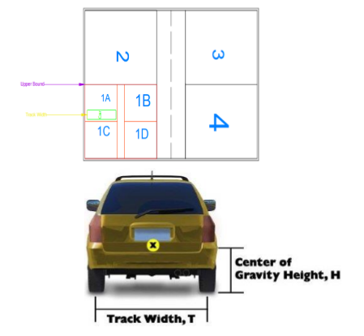
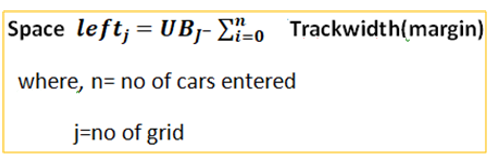
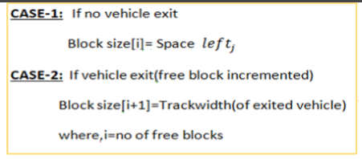
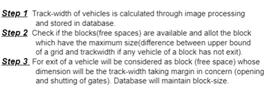
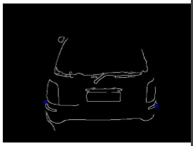
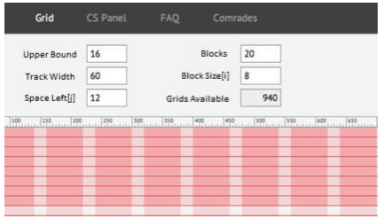

# Prabhavi-Upyog

A cost effective parking solution to address the problems faced by people. The solution is from a space optimization angle. There is a parking area with limited space. Once a vehicle enters, the system should be able to calculate its space requirement for parking and put it in a location to get optimal usage.

GRID SYSTEM: The limited parking space is divided among sections or grids.Each section has a common crosspaths (For entry and exit of vehicles).Upperbound is considered as length of the grid. Free-space in a grid considered as a block. The primary grids (Named 1,2,3,4 ) are sections and secondary grids (1A,1B,1C,1D)further be created as the space permits.

SPACE UTILITY: The space required by the vehicle will be the track- width calculated by image processing. The block (empty space of a grid)allotted to vehicle will be the in largest block(worst fit). The idea of allotment is planned to avoid unused space or fragmentation. More the space left more cars can enter in the grids taken future in concern.

Worst Fit: The algorithm works taking the concept of minimizing fragmentation or left over space to allocate in block size.

Stack Push Allotment: The vehicle alloted will be parked in such a way that it follow stack push which means that vehicle will be alloted from one extreme end to other extreme end. we are not allowing stack pop as if vehicles have tendencies to exit from any point.

Image Processing: For calculating track width of any vehicle, dataset is required from which the features are extracted bt using color histogram method. Further pre-processing the data by splitting it into training and testing set & finally fit it accordingly.

Mathematical Approach:

                    

Algorithm:

Basic Layouts:

						

